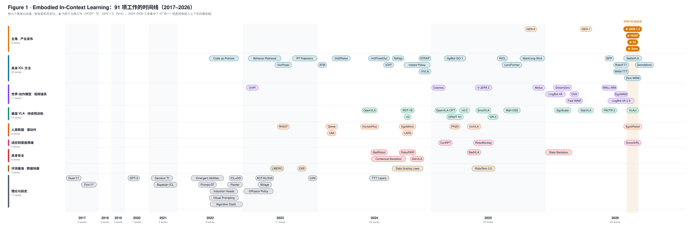
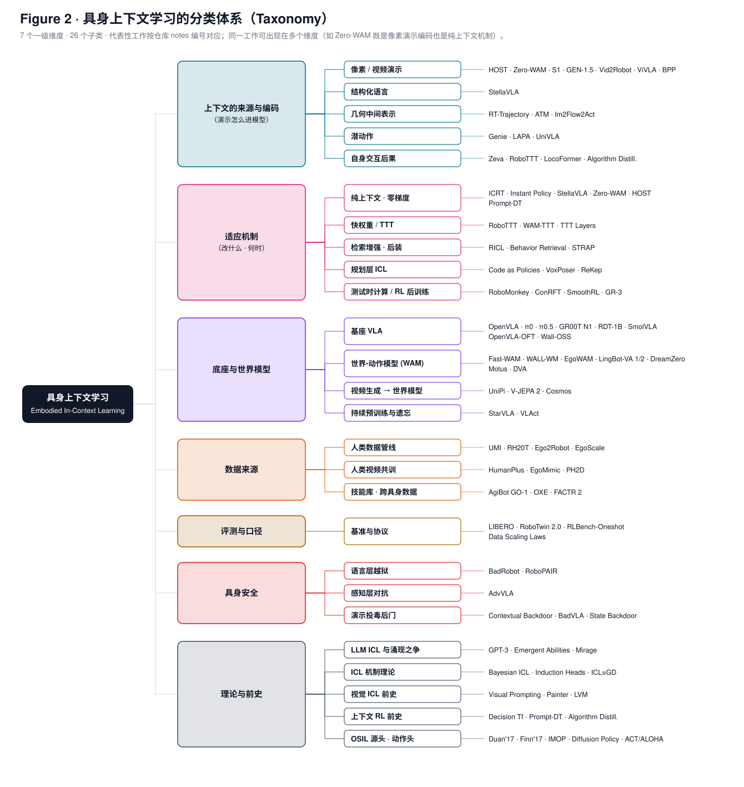

# Awesome Embodied In-Context Learning

[](https://awesome.re)
[](#contributing)
[](#)

具身智能 In-Context Learning（EICL）/ One-Shot 技能习得的论文列表与深度调研仓库。核心问题：**「教机器人一个新技能」正在从训练问题变成提示问题吗？** 当前覆盖 **90 项工作 / 86 篇英文 PDF / 79 篇中译 PDF / 41 份深度解读**，按七个维度组织；⭐ 标注四个主角（HOST · GEN-1.5 · S1 · Zeva）。

## 产物入口（Deliverables）

| 想要 | 打开 | 说明 |
|---|---|---|
| **15 分钟拿到全部结论** | [`report/survey_slides.html`](report/survey_slides.html) · [PDF](report/survey_slides.pdf) | 34 页汇总 PPT，浏览器打开 ← → 翻页、F 全屏 |
| **系统研读** | [`report/survey_full_report.pdf`](report/survey_full_report.pdf) | 158 页全文报告：总览图 + 趋势洞察 + 41 份解读按七维度分部合订 |
| **趋势与洞察** | [`insights/10_trends_insights_zh.md`](insights/10_trends_insights_zh.md) | 六大趋势 · 十三条洞察 · 七条可证伪预测（P5 已被打脸并修正）· 开放问题清单 |
| **研究机会清单** | [`insights/11_open_problems_zh.md`](insights/11_open_problems_zh.md) | 22 个无人占位的空白，按 Part A–G 排列，每条配「为什么重要 + 最小可行实验 + 相关解读」；只做一件事就做第 4 条 |
| **数字口径账本** | [`insights/12_numbers_ledger_zh.md`](insights/12_numbers_ledger_zh.md) | 25 个头条数字逐条标注任务集 / 未见定义 / 指标类型 / 试验规模 / 干预 / 独立性 / 证据形式——并排任何两个数字前先查此表 |
| **总览图** | [图 1 时间线](assets/fig1_timeline.svg) · [图 2 分类树](assets/fig2_taxonomy.svg) | 矢量 SVG；`scripts/make_figures.py` 生成，深色版见 `assets/*_dark*.svg` |
| **四个主角的深读** | [HOST](notes/01_HOST_zh.md) · [GEN 系列](notes/02_GEN_series_zh.md) · [S1 与涌现之争](notes/16_S1_EICL_wave_zh.md) · [Zeva](notes/40_Zeva_zh.md) | 每篇含机制拆解 / 关键数字与口径 / 局限 / 关系定位 |
| **论文原文与中译** | [`papers/pdf/`](papers/pdf/) · [`papers/zh/`](papers/zh/) | 86 篇英文原版 · 79 篇 [SuperTranslate](https://github.com/asimfish/super_translate) 保版式中译 |
| **审校留痕** | [`sources/reviews/`](sources/reviews/) | 三份总结文档经 Codex（gpt-6-astra）终审的原始报告：共 45 条定点修改（数字口径、过强表述、MVE 可行性），已全部应用 |
| **全部解读** | [`notes/`](notes/) | 41 份中文深度解读（编号 01–42），每份的「延伸批判」与「关系定位」两节是与论文摘要差异最大的增量 |

> 所有成功率数字都依赖各自的任务集与判定口径，**不同工作的数字禁止直接比大小**；详见各篇解读的「延伸批判」节与 [Part E](#part-e--评测与口径数字从哪来)。

## 总览图



*图 1 · 90 项工作的时间线：按九个家族分泳道、按发表年月定位，★ 为四个主角，橙色竖带为 2026-08 拐点月。*



*图 2 · 具身上下文学习的分类体系：七个一级维度、26 个子类——与下文 Part A–G 一一对应。*

## 为什么是拐点

2026 年 8 月，互不相识的机构在一个月内汇合于同一能力点：**HOST**（开源）用架构设计让机器人看一段人类视频、29 秒后执行新任务（50 个未见任务 62%）；**GEN-1.5** 用 50 万小时数据预训练让 one-shot ICL 作为涌现能力出现（10 任务 59%）；**S1** 把主张推到最远——一条视频演示执行预训练从未见过、最长 10 分钟的任务（66%，语言提示同规模仅 9%）；月末 **Zeva** 把上下文来源从「他人的演示」扩到「自己的交互后果」，冻结策略四次尝试内累计 26% → 73%。同月，四篇学术论文（WAM-TTT / RoboTTT / StellaVLA / Zero-WAM）用消融证据一致反对「ICL 免费涌现」叙事。本仓库是对这场汇合与争论的完整调研。

## 目录（Content）

<table>
<tr><td colspan="2"><a href="#part-a--主线2026-08-拐点与四个主角"><b>Part A · 主线：2026-08 拐点与四个主角</b>&emsp;<i>Headline Works</i></a></td></tr>
<tr>
	<td>&emsp;<a href="#a1-industry-releases--headline-works">A1. Industry Releases & Headline Works</a></td>
	<td></td>
</tr>
<tr><td colspan="2"><a href="#part-b--具身-icl-方法演示怎么被策略用上"><b>Part B · 具身 ICL 方法：演示怎么被策略用上</b>&emsp;<i>Embodied ICL Methods</i></a></td></tr>
<tr>
	<td>&emsp;<a href="#b1-structure-designed-one-shot">B1. Structure-Designed One-Shot</a></td>
	<td>&emsp;<a href="#b2-fast-weights--test-time-training">B2. Fast Weights & Test-Time Training</a></td>
</tr>
<tr>
	<td>&emsp;<a href="#b3-pure-in-context-conditioning">B3. Pure In-Context Conditioning</a></td>
	<td>&emsp;<a href="#b4-data-recipes--post-hoc-icl">B4. Data Recipes & Post-hoc ICL</a></td>
</tr>
<tr>
	<td>&emsp;<a href="#b5-geometric-demonstration-encodings">B5. Geometric Demonstration Encodings</a></td>
	<td>&emsp;<a href="#b6-planner-level-icl">B6. Planner-Level ICL</a></td>
</tr>
<tr>
	<td>&emsp;<a href="#b7-retrieval--skill-libraries">B7. Retrieval & Skill Libraries</a></td>
	<td>&emsp;<a href="#b8-adaptation-dial-extremes">B8. Adaptation-Dial Extremes</a></td>
</tr>
<tr><td colspan="2"><a href="#part-c--底座与世界模型icl-站在谁的肩上"><b>Part C · 底座与世界模型：ICL 站在谁的肩上</b>&emsp;<i>Backbones & World Models</i></a></td></tr>
<tr>
	<td>&emsp;<a href="#c1-foundation-vlas-backbones--baselines">C1. Foundation VLAs (Backbones & Baselines)</a></td>
	<td>&emsp;<a href="#c2-open--efficient-vlas">C2. Open & Efficient VLAs</a></td>
</tr>
<tr>
	<td>&emsp;<a href="#c3-vla-baselines-force--human-data-scaling">C3. VLA Baselines, Force & Human-Data Scaling</a></td>
	<td>&emsp;<a href="#c4-world-action-models">C4. World Action Models</a></td>
</tr>
<tr>
	<td>&emsp;<a href="#c5-video-action-contemporaries">C5. Video-Action Contemporaries</a></td>
	<td>&emsp;<a href="#c6-world-model-lineage-upstream">C6. World-Model Lineage (Upstream)</a></td>
</tr>
<tr>
	<td>&emsp;<a href="#c7-post-training-interference--forgetting">C7. Post-Training Interference & Forgetting</a></td>
	<td></td>
</tr>
<tr><td colspan="2"><a href="#part-d--数据人类数据进机器人的三条桥"><b>Part D · 数据：人类数据进机器人的三条桥</b>&emsp;<i>Human Data</i></a></td></tr>
<tr>
	<td>&emsp;<a href="#d1-human-data-pipelines">D1. Human-Data Pipelines</a></td>
	<td>&emsp;<a href="#d2-human-video-co-training">D2. Human-Video Co-Training</a></td>
</tr>
<tr>
	<td>&emsp;<a href="#d3-latent-action-bridge">D3. Latent-Action Bridge</a></td>
	<td></td>
</tr>
<tr><td colspan="2"><a href="#part-e--评测与口径数字从哪来"><b>Part E · 评测与口径：数字从哪来</b>&emsp;<i>Benchmarks & Calibers</i></a></td></tr>
<tr>
	<td>&emsp;<a href="#e1-benchmarks--data-foundations">E1. Benchmarks & Data Foundations</a></td>
	<td></td>
</tr>
<tr><td colspan="2"><a href="#part-f--具身安全技能接口开放后的攻击面"><b>Part F · 具身安全：技能接口开放后的攻击面</b>&emsp;<i>Embodied Safety</i></a></td></tr>
<tr>
	<td>&emsp;<a href="#f1-embodied-safety--prompt-injection">F1. Embodied Safety & Prompt Injection</a></td>
	<td></td>
</tr>
<tr><td colspan="2"><a href="#part-g--理论与前史icl-本身是什么"><b>Part G · 理论与前史：ICL 本身是什么</b>&emsp;<i>Theory & Precursors</i></a></td></tr>
<tr>
	<td>&emsp;<a href="#g1-llm-background-the-emergence-debate">G1. LLM Background: The Emergence Debate</a></td>
	<td>&emsp;<a href="#g2-icl-theory--mechanisms">G2. ICL Theory & Mechanisms</a></td>
</tr>
<tr>
	<td>&emsp;<a href="#g3-visual-icl-precursors">G3. Visual ICL Precursors</a></td>
	<td>&emsp;<a href="#g4-in-context-rl-precursors">G4. In-Context RL Precursors</a></td>
</tr>
<tr>
	<td>&emsp;<a href="#g5-one-shot-imitation-origins-2017">G5. One-Shot Imitation Origins (2017→)</a></td>
	<td>&emsp;<a href="#g6-generative-action-heads">G6. Generative Action Heads</a></td>
</tr>
<tr><td colspan="2"><a href="#repository-structure">Repository Structure</a></td></tr>
<tr><td colspan="2"><a href="#recommended-reading-order">Recommended Reading Order</a></td></tr>
<tr><td colspan="2"><a href="#reproduce">Reproduce</a></td></tr>
<tr><td colspan="2"><a href="#contributing">Contributing</a></td></tr>
</table>

## Part A · 主线：2026-08 拐点与四个主角

*Headline Works* — 一个月内四家互不相识的机构汇合于同一能力点。先读这里，再按兴趣进入 B–G。

### A1. Industry Releases & Headline Works

四个主角：HOST 是唯一论文 + 代码 + 权重全开源、口径可复查的一家；GEN-1.5 与 S1 为公司技术博客（无同行评审、无开源、内部 benchmark，证据是 demo 视频与内部曲线）；Zeva 是唯一把上下文从「他人演示」扩到「自身交互后果」的工作。四家 62% / 59% / 66% / 73%（累计）落在同一区间纯属口径巧合，禁止直接比。

1. **HOST: Robots Acquire Manipulation Skills in Seconds from a Single Human Video.** arXiv, 2026. [paper](https://arxiv.org/abs/2607.20033) [📄解读](notes/01_HOST_zh.md) [🈶中译](papers/zh/HOST_2607.20033_zh.pdf) ⭐

    *Guangyan Chen et al. — 北京理工大学 · X SQUARE ROBOT（自变量机器人）· 清华大学 · 2026-08-03 论文/代码/权重全开源，产业系工作中唯一可复核*

2. **GEN-0 / GEN-1 / GEN-1.5: Embodied Foundation Models are One-Shot Learners.** Generalist AI Blog, 2025-11 / 2026-04 / 2026-08. [blog](https://generalistai.com/blog/gen-1.5) [📄解读](notes/02_GEN_series_zh.md) ⭐

    *Generalist AI Team — 50 万小时数据；「physical prompting」命名确立者；涌现叙事代表*

3. **Introducing S1: In-Context Learning for Robotics.** Skild AI Blog, 2026-08-18. [blog](https://www.skild.ai/blogs/s1) [📄解读](notes/16_S1_EICL_wave_zh.md) [存档](sources/skild_s1_blog.txt) ⭐

    *Skild AI Team — 唯一同时主张「任务未见 × 10 分钟长时程」两轴；单条演示 ≈ 380 条后训练示范*

4. **Zeva: In-Context Causal Learning for Generalizable Embodied Manipulation.** arXiv, 2026-08-31. [paper](https://arxiv.org/abs/2608.30880) [📄解读](notes/40_Zeva_zh.md) [🈶中译](papers/zh/Zeva_2608.30880_zh.pdf) ⭐

    *Fu Chen, Xin Ding, et al. — 清华 AIR · Z-Trans AI（域变换）· 上下文从「他人演示」扩到「自己的交互后果」：因果交互编码 + 双时间尺度记忆（BIT/PIM）+ 检索注入冻结策略；RoboCasa365-Atomic5 76.8% 超 Fast-WAM 72.4%，四次尝试内累计 26% → 73%，真机 ChemLab-Evo 三级全胜；人类演示叠加再 +15%——Algorithm Distillation「上下文内 RL」在操作域的首个完整实现，注意 CSR@K 口径需与独立重试基线对照*

## Part B · 具身 ICL 方法：演示怎么被策略用上

*Embodied ICL Methods* — 按「演示改什么 × 何时适应」分：结构派、快权重、纯上下文、数据配方；再加三种非像素的上下文形态（几何编码、规划层、检索）与适应刻度盘两端。

### B1. Structure-Designed One-Shot

结构派：把「对齐」「跨域翻译」显式设计进模型，小数据可达。

1. **Instant Policy: In-Context Imitation Learning via Graph Diffusion.** ICLR 2025. [paper](https://arxiv.org/abs/2411.12633) [📄解读](notes/03_InstantPolicy_zh.md) [🈶中译](papers/zh/InstantPolicy_2411.12633_zh.pdf)

    *Vitalis Vosylius, Edward Johns — Imperial College London · 图扩散 + 仿真伪演示无限生成*

2. **Vid2Robot: End-to-end Video-conditioned Policy Learning with Cross-Attention Transformers.** RSS 2024. [paper](https://arxiv.org/abs/2403.12943) [📄解读](notes/08_Vid2Robot_zh.md) [🈶中译](papers/zh/Vid2Robot_2403.12943_zh.pdf)

    *Vidhi Jain, Maria Attarian, et al. — Google DeepMind · CMU · Toronto · TCC 作辅助损失的前辈路线，HOST 口径下 19%*

3. **SOTA (ViVLA): See Once, Then Act.** arXiv, 2025. [paper](https://arxiv.org/abs/2512.07582) [📄解读](notes/09_related_quick_reviews_zh.md) [🈶中译](papers/zh/SOTA_SeeOnceThenAct_2512.07582_zh.pdf)

    *Guangyan Chen et al. — 北京理工大学 · HOST 一作团队直系前作，隐动作端到端路线*

4. **ManiLong-Shot: Interaction-Aware One-Shot Imitation Learning for Long-Horizon Manipulation.** AAAI 2026. [paper](https://arxiv.org/abs/2512.16302) [📄解读](notes/21_ManiLongShot_zh.md) [🈶中译](papers/zh/ManiLongShot_2512.16302_zh.pdf)

    *附 RLBench-Oneshot 基准（10 短程 + 20 长程三档）· 交互原语分解 + 不变区域匹配；未见长程任务 30.2% vs IMOP 7.4%——标准协议下长程 one-shot 的真实水位*

### B2. Fast Weights & Test-Time Training

快权重与长上下文派：演示（或自身历史）写进测试时可更新的记忆，主干冻结。

1. **RoboTTT: Context Scaling for Robot Policies.** arXiv, 2026. [paper](https://arxiv.org/abs/2607.15275) [📄解读](notes/05_RoboTTT_zh.md) [🈶中译](papers/zh/RoboTTT_2607.15275_zh.pdf)

    *Yunfan Jiang, Yevgen Chebotar, Ruijie Zheng, et al. — NVIDIA GEAR · Stanford · UT Austin · 上下文 8K 步无饱和；快权重=每步递归更新的工作记忆*

2. **WAM-TTT: Steering World-Action Models by Watching Human Play at Test Time.** arXiv, 2026. [paper](https://arxiv.org/abs/2607.06988) [📄解读](notes/14_WAMTTT_zh.md) [🈶中译](papers/zh/WAMTTT_2607.06988_zh.pdf)

    *北京大学 · 银河通用 Galbot · 中科院自动化所 · 清华大学 · 快权重=部署前装好的技能包；KVM 损失等价无 softmax 线性注意力；配对人类数据 1:1 顶替机器人数据*

3. **LocoFormer: Generalist Locomotion via Long-context Adaptation.** CoRL 2025. [paper](https://arxiv.org/abs/2509.23745) [📄解读](notes/17_LocoFormer_zh.md) [🈶中译](papers/zh/LocoFormer_2509.23745_zh.pdf)

    *Min Liu, Deepak Pathak, Ananye Agarwal — Skild AI · S1 直系前作：TXL 跨 episode 长上下文 + 程序化生成机器人大规模 RL；锁膝/断腿/上高跷 2-3 trial 内涌现适应*

### B3. Pure In-Context Conditioning

纯上下文派：模型参数一个不动，只改输入。GEN-1.5 与 S1 主张的路线落在此格。

1. **In-Context Imitation Learning via Next-Token Prediction (ICRT).** ICRA 2025. [paper](https://arxiv.org/abs/2408.15980) [📄解读](notes/04_ICRT_zh.md) [🈶中译](papers/zh/ICRT_2408.15980_zh.pdf)

    *Letian Fu, Huang Huang, Gaurav Datta, et al. — UC Berkeley · Autodesk · NTP 最小可行原型：1098 条结构对的数据 > 1 万条单任务数据*

2. **StellaVLA: In-Context Structured Demonstration for Generalizable Vision-Language-Action Models.** arXiv, 2026. [paper](https://arxiv.org/abs/2608.11671) [📄解读](notes/15_StellaVLA_zh.md) [🈶中译](papers/zh/StellaVLA_2608.11671_zh.pdf)

    *StellarEdge AI — 演示离线转译成结构化语言（做了什么→为什么）；首创三向干预实验：对 98.8 / 无 62.4 / 错 44.9*

3. **Zero-WAM: In-Context World-Action Modeling from Human Videos for Open-Ended Task Generalization.** arXiv, 2026. [paper](https://arxiv.org/abs/2608.26103) [📄解读](notes/12_ZeroWAM_zh.md) [🈶中译](papers/zh/ZeroWAM_2608.26103_zh.pdf)

    *Zhou et al. — Robbyant · HKUST(GZ) · HKUST · 唯一正面攻打未见任务（46.95% vs 17.45%）；HumanGen 合成 74.2K 人-机配对；IFP 消融证明纯上下文路线需要显式反捷径机制*

### B4. Data Recipes & Post-hoc ICL

数据配方派与事后注入派：驱动 ICL 的不是数据量而是数据结构；预训练 VLA 可事后加装 ICL。

1. **Behavior Prompting Policy: Demonstrations as Prompts for Manipulation (BPP).** arXiv, 2026. [paper](https://arxiv.org/abs/2606.30457) [📄解读](notes/06_BPP_zh.md) [🈶中译](papers/zh/BPP_2606.30457_zh.pdf)

    *Austin Patel, Ben Pekarek, Joel Enrique Castro Hernandez, Shuran Song — Stanford · UC Berkeley · 任务多样性定律：固定预算下 2000 任务 × 5 条完胜少任务 × 多条*

2. **RICL: Adding In-Context Adaptability to Pre-Trained Vision-Language-Action Models.** CoRL 2025. [paper](https://arxiv.org/abs/2508.02062) [📄解读](notes/07_RICL_zh.md) [🈶中译](papers/zh/RICL_2508.02062_zh.pdf)

    *Kaustubh Sridhar, Souradeep Dutta, Dinesh Jayaraman, Insup Lee — UPenn · UBC · 400 条演示给 π0-FAST 后装 ICL：2.5% → 31.25%（零更新）*

### B5. Geometric Demonstration Encodings

「演示的另一种编码」——末端轨迹草图、任意点轨迹、物体光流当提示：外观与具身不变、空间精度高、人可读可画（详见 [notes/34](notes/34_visual_prompt_intermediates_zh.md)）。

1. **RT-Trajectory: Robotic Task Generalization via Hindsight Trajectory Sketches.** ICLR 2024. [paper](https://arxiv.org/abs/2311.01977) [📄解读](notes/34_visual_prompt_intermediates_zh.md) [🈶中译](papers/zh/RTTrajectory_2311.01977_zh.pdf)

    *Jiayuan Gu, Sean Kirmani, et al. — Google DeepMind · 人手画一条末端轨迹草图当任务条件，未见任务 2D 50% / 2.5D 67% vs RT-2 11.1%；提示可来自手画/LLM 代码/人类手部姿态/检索——2023 年最接近「物理提示」的工作*

2. **ATM: Any-point Trajectory Modeling for Policy Learning.** RSS 2024. [paper](https://arxiv.org/abs/2401.00025) [📄解读](notes/34_visual_prompt_intermediates_zh.md) [🈶中译](papers/zh/ATM_2401.00025_zh.pdf)

    *Chuan Wen, Xingyu Lin, et al. — Berkeley 等 · 从无动作视频预训练任意点未来轨迹模型，轨迹当稠密控制引导；130 余任务平均超视频预训练基线 80%，可从人类与异形态机器人视频迁移*

3. **Im2Flow2Act: Flow as the Cross-Domain Manipulation Interface.** CoRL 2024. [paper](https://arxiv.org/abs/2407.15208) [📄解读](notes/34_visual_prompt_intermediates_zh.md) [🈶中译](papers/zh/Im2Flow2Act_2407.15208_zh.pdf)

    *Mengda Xu, et al. — Columbia 等 · 物体光流作人-机接口，在接口层直接去掉具身信息；真实人类视频 + 仿真机器人玩耍数据，零真机数据达四任务平均 81%*

### B6. Planner-Level ICL

「LLM 自己的 few-shot 能力直接拿来控机器人」——ICL 发生在规划层而非策略层，2022 年即零训练实现「教机器人不用训练」，但天花板由原语库与规划器决定（详见 [notes/35](notes/35_planner_level_icl_zh.md)）。

1. **Code as Policies: Language Model Programs for Embodied Control.** ICRA 2023. [paper](https://arxiv.org/abs/2209.07753) [📄解读](notes/35_planner_level_icl_zh.md) [🈶中译](papers/zh/CodeAsPolicies_2209.07753_zh.pdf)

    *Jacky Liang, Wenlong Huang, et al. — Google · few-shot 提示让 LLM 为新指令写机器人程序（感知 API + 控制 API + NumPy/Shapely）；层级代码生成同时把 HumanEval 推到 39.8%——「演示当 prompt」的文本版鼻祖*

2. **VoxPoser: Composable 3D Value Maps for Robotic Manipulation with Language Models.** CoRL 2023. [paper](https://arxiv.org/abs/2307.05973) [📄解读](notes/35_planner_level_icl_zh.md) [🈶中译](papers/zh/VoxPoser_2307.05973_zh.pdf)

    *Wenlong Huang, Chen Wang, et al. — Stanford · LLM 写代码合成 3D 值图，运动规划器零样本求轨迹；真机日常任务 88.0%（干扰下 70.0%）vs 原语基线 24.0%——ICL 输出从程序推进到连续空间场*

3. **ReKep: Spatio-Temporal Reasoning of Relational Keypoint Constraints for Robotic Manipulation.** CoRL 2024. [paper](https://arxiv.org/abs/2409.01652) [📄解读](notes/35_planner_level_icl_zh.md) [🈶中译](papers/zh/ReKep_2409.01652_zh.pdf)

    *Wenlong Huang, Chen Wang, et al. — Stanford · DINOv2+SAM 提关键点、GPT-4o 看图写分阶段约束函数、层级优化实时求解；双臂与移动平台七任务自动标注版 68.6% vs VoxPoser 10.0%；分阶段约束与 HOST 进度流形描述同一时间结构*

### B7. Retrieval & Skill Libraries

「上下文从哪里来」——非参数记忆库是 ICL 的上游、替代品与攻击面（详见 [notes/36](notes/36_retrieval_and_skill_libraries_zh.md)）。

1. **Behavior Retrieval: Few-Shot Imitation Learning by Querying Unlabeled Datasets.** RSS 2023. [paper](https://arxiv.org/abs/2304.08742) [📄解读](notes/36_retrieval_and_skill_libraries_zh.md) [🈶中译](papers/zh/BehaviorRetrieval_2304.08742_zh.pdf)

    *Maximilian Du, Suraj Nair, Dorsa Sadigh, Chelsea Finn — Stanford · 少量专家数据当查询，VAE 嵌入空间从无标注离线库检索相关转移并过滤次优数据——「上下文该放什么」的第一个系统回答*

2. **STRAP: Robot Sub-Trajectory Retrieval for Augmented Policy Learning.** arXiv, 2024. [paper](https://arxiv.org/abs/2412.15182) [📄解读](notes/36_retrieval_and_skill_libraries_zh.md) [🈶中译](papers/zh/STRAP_2412.15182_zh.pdf)

    *Marius Memmel, Jacob Berg, et al. — UW · Bosch · CMU · 子轨迹粒度检索 + DINOv2 嵌入 + 子序列 DTW，主张「部署时训练」而非零样本；与 HOST 的 SDTW 同工具异用，指向「长时程演示应切片进上下文」*

3. **AgiBot World Colosseo: A Large-scale Manipulation Platform for Scalable and Intelligent Embodied Systems (GO-1).** arXiv, 2025. [paper](https://arxiv.org/abs/2503.06669) [📄解读](notes/36_retrieval_and_skill_libraries_zh.md) [🈶中译](papers/zh/AgiBotGO1_2503.06669_zh.pdf)

    *智元机器人 — 100 万+ 轨迹 / 217 任务 / 五类场景，预训练超 OXE 30%、十分之一小时数即 +18%；GO-1 的 ViLLA 三段架构（潜动作模型 + 潜动作规划器 + 动作专家）具备 ICL 化的两个前提却尚未做 ICL——与 HOST、Zero-WAM 形成各缺一角的三角*

### B8. Adaptation-Dial Extremes

「适应预算旋钮」的两个新刻度：不改权重的测试时计算，与改权重的真机 RL（详见 [notes/39](notes/39_adaptation_dial_extremes_zh.md)）。

1. **RoboMonkey: Scaling Test-Time Sampling and Verification for VLA Models.** arXiv, 2025. [paper](https://arxiv.org/abs/2506.17811) [📄解读](notes/39_adaptation_dial_extremes_zh.md) [🈶中译](papers/zh/RoboMonkey_2506.17811_zh.pdf)

    *Jacky Kwok, et al. — Stanford · Berkeley · NVIDIA · 动作误差随采样数呈幂律——推理时 scaling law；采样 + 高斯扰动投票 + VLM 验证器，分布外 +25% / 分布内 +9%；验证器即 notes/33 所需「独立于演示通道的安全裁决器」的现成形态*

2. **ConRFT: A Reinforced Fine-tuning Method for VLA Models via Consistency Policy.** RSS 2025. [paper](https://arxiv.org/abs/2502.05450) [📄解读](notes/39_adaptation_dial_extremes_zh.md) [🈶中译](papers/zh/ConRFT_2502.05450_zh.pdf)

    *Yuhui Chen, et al. — 中科院自动化所 · 一致性目标的离线 + 人在环在线两阶段 RL 微调，八个真机任务 45–90 分钟到 96.3%（较监督 +144%）——ICL 解决「能不能做」，RL 后训练解决「做得多可靠」*

3. **SmoothRL: Online Reinforcement Learning During Asynchronous Execution.** arXiv, 2026-08-30. [paper](https://arxiv.org/abs/2608.29768) [📄解读](notes/42_SmoothRL_zh.md) [🈶中译](papers/zh/SmoothRL_2608.29768_zh.pdf)

    *Astribot Team（星尘智能）— 指出真机在线 RL 的训练-部署错位：动作分块 + 异步推理下每块只有一部分被执行，同步假设的值梯度流进从未进入环境的动作（梯度污染）；解法是 committed / execution / discarded 三段划分 + 只对 execution 段回传值梯度 + critic 看全跨度 + 训练时就跑异步循环。冻结 π0.5 外挂轻量残差 actor-critic，Astribot S1 三任务 250 episode：抛掷 39→94%、笔帽 8→83%、开箱 30→90%，加速度/jerk RMS 降 52%/47%；单次运行、缺异步基线与消融*

## Part C · 底座与世界模型：ICL 站在谁的肩上

*Backbones & World Models* — 被 ICL 工作用作主干或基线的基座 VLA、世界-动作模型（WAM）及其视频生成上游，以及「后面的训练怎样吃掉前面的能力」。

### C1. Foundation VLAs (Backbones & Baselines)

「ICL 工作站在谁的肩上」——被本仓库多篇工作用作主干或基线的三个基座模型（详见 [notes/24](notes/24_foundation_VLAs_zh.md)）。

1. **OpenVLA: An Open-Source Vision-Language-Action Model.** CoRL 2024. [paper](https://arxiv.org/abs/2406.09246) [📄解读](notes/24_foundation_VLAs_zh.md) [🈶中译](papers/zh/OpenVLA_2406.09246_zh.pdf)

    *Moo Jin Kim, Karl Pertsch, Siddharth Karamcheti, et al. — Stanford · UC Berkeley · 7B 自回归离散 token VLA（97 万条 OXE 轨迹）；ICRT 与 π0 的公共基线；单图/无历史/无动作块的结构使其成为「语言接口传达不了运动模式」的对照组*

2. **π0: A Vision-Language-Action Flow Model for General Robot Control.** arXiv, 2024. [paper](https://arxiv.org/abs/2410.24164) [📄解读](notes/24_foundation_VLAs_zh.md) [🈶中译](papers/zh/pi0_2410.24164_zh.pdf)

    *Physical Intelligence — PaliGemma 3B + 300M flow matching 动作专家（H=50，50Hz），约 1 万小时专有数据确立「VLM + 连续动作块」范式；RICL 的底座、GR-3 的对照、π0.5 的前作、GR00T N1 的设计上游*

3. **GR00T N1: An Open Foundation Model for Generalist Humanoid Robots.** arXiv, 2025. [paper](https://arxiv.org/abs/2503.14734) [📄解读](notes/24_foundation_VLAs_zh.md) [🈶中译](papers/zh/GR00TN1_2503.14734_zh.pdf)

    *NVIDIA — 2.2B 双系统（Eagle-2 VLM + 跨注意力 DiT，H=16，4 步去噪），8,376 小时四层数据金字塔（真机仅 88 小时）；System 1 自足的解耦结构正是 RoboTTT 能只在动作侧插 TTT 层的前提*

### C2. Open & Efficient VLAs

「基线的基线」——被 ICL 论文当对照的第二梯队，以及「微调配方比模型本身更影响数字」的实证（详见 [notes/38](notes/38_open_efficient_VLAs_zh.md)）。

1. **RDT-1B: A Diffusion Foundation Model for Bimanual Manipulation.** ICLR 2025. [paper](https://arxiv.org/abs/2410.07864) [📄解读](notes/38_open_efficient_VLAs_zh.md) [🈶中译](papers/zh/RDT1B_2410.07864_zh.pdf)

    *Songming Liu, et al. — 清华 TSAIL · 1.2B 纯扩散双臂基座（46 数据集 / 100 万+ 轨迹 / 21TB），物理可解释统一动作空间；真机超基线 56%，1–5 样本学新技能；GO-1 与 OpenVLA-OFT 的对照基线*

2. **OpenVLA-OFT: Fine-Tuning Vision-Language-Action Models — Optimizing Speed and Success.** arXiv, 2025. [paper](https://arxiv.org/abs/2502.19645) [📄解读](notes/38_open_efficient_VLAs_zh.md) [🈶中译](papers/zh/OpenVLAOFT_2502.19645_zh.pdf)

    *Moo Jin Kim, Chelsea Finn, Percy Liang — Stanford · 同一 OpenVLA 换微调配方（并行解码 + 连续动作 + L1 + 分块）：LIBERO 76.5% → 97.1%，吞吐 26 倍——「基线配方决定数字」最干净的证据，也把 LIBERO 推到饱和*

3. **SmolVLA: A Vision-Language-Action Model for Affordable and Efficient Robotics.** arXiv, 2025. [paper](https://arxiv.org/abs/2506.01844) [📄解读](notes/38_open_efficient_VLAs_zh.md) [🈶中译](papers/zh/SmolVLA_2506.01844_zh.pdf)

    *Mustafa Shukor, et al. — Hugging Face · 4.5 亿参数、不到 3 万条社区数据、消费级 GPU/CPU 可跑，与 10 倍大 VLA 可比；参数量不是能力代理——涌现之争中「规模」需拆成数据小时、任务覆盖、参数量三维*

### C3. VLA Baselines, Force & Human-Data Scaling

1. **π0.5: A Vision-Language-Action Model with Open-World Generalization.** arXiv, 2025. [paper](https://arxiv.org/abs/2504.16054) [📄解读](notes/09_related_quick_reviews_zh.md) [🈶中译](papers/zh/pi05_2504.16054_zh.pdf)

    *Physical Intelligence — 语言条件零样本 IL 的上限对照（HOST 口径 ≤17%）*

2. **Wall-OSS: Igniting VLMs toward the Embodied Space.** arXiv, 2025. [paper](https://arxiv.org/abs/2509.11766) [📄解读](notes/09_related_quick_reviews_zh.md) [🈶中译](papers/zh/WallOSS_2509.11766_zh.pdf)

    *X Square Robot Team（自变量）— 最强 SFT 微调基线（56%，旧技能存留 43%），开源*

3. **EgoScale: Scaling Egocentric Human Videos for Vision-Language-Action Pre-Training.** arXiv, 2026. [paper](https://arxiv.org/abs/2602.16710) [📄解读](notes/09_related_quick_reviews_zh.md) [🈶中译](papers/zh/EgoScale_2602.16710_zh.pdf)

    *NVIDIA GEAR · UC Berkeley · UMD — 20,854 小时第一人称人类视频；log-linear scaling law（R²=0.998）*

4. **GR-3 Technical Report.** arXiv, 2025. [paper](https://arxiv.org/abs/2507.15493) [📄解读](notes/20_GR3_zh.md) [🈶中译](papers/zh/GR3_2507.15493_zh.pdf)

    *字节跳动 Seed — few-shot 微调流派工业标杆：4B MoT VLA + 三源数据配方，每新物体仅 10 条 VR 人类轨迹适配；ICL 阵营要淘汰的正是这个工作流的最强版本*

5. **FACTR 2: Learning External Force Sensing for Commodity Robot Arms Improves Policy Learning.** arXiv, 2026. [paper](https://arxiv.org/abs/2606.12406) [📄解读](notes/18_FACTR2_zh.md) [🈶中译](papers/zh/FACTR2_2606.12406_zh.pdf)

    *Steven Oh, Jason Jingzhou Liu, et al. — CMU · 早稻田 · NEXT 零硬件力估计（10 分钟数据/1 分钟训练）+ FIRST 力知情重采样（+17%）；被 S1 博客外推引用为「预训练价值有限」的证据——本仓库核实该引用为弱支撑（见解读 §6）*

### C4. World Action Models

WAM 底座层：不直接做 ICL，决定 ICL 的上限——监督单元、世界表征与「要不要想象」。

1. **Fast-WAM: World Action Models Do Not Need Test-Time Video Modeling.** arXiv, 2026. [paper](https://arxiv.org/abs/2603.16666) [📄解读](notes/09_related_quick_reviews_zh.md) [🈶中译](papers/zh/FastWAM_2603.16666_zh.pdf)

    *清华大学 IIIS — 视频建模收益在训练时而非测试时；MoT 双专家架构是 HOST 主干来源*

2. **WALL-WM: Carving World Action Modeling at the Event Joints.** arXiv, 2026. [paper](https://arxiv.org/abs/2606.01955) [📄解读](notes/13_WALLWM_zh.md) [🈶中译](papers/zh/WALLWM_2606.01955_zh.pdf)

    *Shalfun Li et al. — X Square Robot Team（自变量，Wall-OSS 同门）· 「语义事件」替代固定 chunk 作原子单元；多样操作 75.86 vs π0.5 55.64（progress 口径）*

3. **EgoWAM: World Action Models Beyond Pixels with In-the-Wild Egocentric Human Data.** arXiv, 2026. [paper](https://arxiv.org/abs/2607.08436) [📄解读](notes/11_EgoWAM_zh.md) [🈶中译](papers/zh/EgoWAM_2607.08436_zh.pdf)

    *Baoyu Li, Xinchen Yin, Mengying Lin, Yixin Zhang, Danfei Xu — Georgia Tech · 受控对比 Pixel/DINO/3D flow 三种世界表征：DINO OOD 最高 4 倍，3D flow 域内 +20–30%*

4. **LingBot-VA: Causal World Modeling for Robot Control.** RSS 2026. [paper](https://arxiv.org/abs/2601.21998) [📄解读](notes/19_LingBotVA_zh.md) [🈶中译](papers/zh/LingBotVA_2601.21998_zh.pdf)

    *Lin Li, Qihang Zhang, Yiming Luo, et al. — 蚂蚁 Robbyant · 「测试时保留完整想象」路线代表；RoboTwin 2.0 五十任务 92.93/91.55 超 π0.5；Zero-WAM 同门前作，开源*

5. **LingBot-VA 2.0: Native Video-Action Pretraining for Generalizable Robot Control.** arXiv, 2026. [paper](https://arxiv.org/abs/2607.08639) [📄解读](notes/19_LingBotVA_zh.md) [🈶中译](papers/zh/LingBotVA2_2607.08639_zh.pdf)

    *蚂蚁 Robbyant · 判「改造视频生成模型」死刑：从头因果预训练 + 语义视觉-动作 tokenizer + 稀疏 MoE + Foresight Reasoning 225Hz；收编 Zero-WAM 式视频 ICL*

### C5. Video-Action Contemporaries

「WAM 战场的其他玩家」——被反复当基线或并列引用、却未被单独审视的同代对照组（详见 [notes/28](notes/28_video_action_contemporaries_zh.md)）。

1. **DreamZero: World Action Models are Zero-shot Policies.** arXiv, 2026. [paper](https://arxiv.org/abs/2602.15922) [📄解读](notes/28_video_action_contemporaries_zh.md) [🈶中译](papers/zh/DreamZero_2602.15922_zh.pdf)

    *Seonghyeon Ye, et al.（Yuke Zhu, Jim Fan, Joel Jang 领导）— NVIDIA GEAR · 像素想象派旗舰：14B Wan 骨干、视频-动作单流共享时间步联合去噪，38 倍加速买回 7Hz；无 ICL，是 WAM 装上 ICL 机制前的「素体」；WALL-WM 的数字基线*

2. **Motus: A Unified Latent Action World Model.** arXiv, 2025. [paper](https://arxiv.org/abs/2512.13030) [📄解读](notes/28_video_action_contemporaries_zh.md) [🈶中译](papers/zh/Motus_2512.13030_zh.pdf)

    *Hongzhe Bi, Hengkai Tan, et al. — 清华 · 北大 · 地平线 · 一模型五模式（VLA/WM/IDM/VGM/联合）的 8B MoT，光流潜动作作跨具身桥；RoboTwin 2.0 上被 LingBot-VA 两代与 Fast-WAM 一致超越——同一 π0.5 基线在其论文复现 43、在 LingBot-VA 复现 83，40 分离散让所有「+N%」落进噪声区*

3. **DVA: Causal Video Models Are Data-Efficient Robot Policy Learners.** Rhoda AI Blog, 2026-03. [blog 存档](sources/rhoda_dva_blog.txt) [📄解读](notes/28_video_action_contemporaries_zh.md)

    *Rhoda AI Research — 仅博客无论文：从零因果视频模型 + 每具身 10 小时逆动力学，「把人类演示注入上下文」即 ICL，无对齐模块、无反捷径目标、无任何数字；LingBot-VA 2.0 引入视频 ICL 时与 Zero-WAM 并列引用；证据形态应与 S1/GEN-1.5 同等对待*

### C6. World-Model Lineage (Upstream)

「视频先验进入机器人」的三代上游谱系（详见 [notes/23](notes/23_worldmodel_lineage_zh.md)）：像素想象当策略 → 表征空间预测 → 平台化。

1. **UniPi: Learning Universal Policies via Text-Guided Video Generation.** NeurIPS 2023. [paper](https://arxiv.org/abs/2302.00111) [📄解读](notes/23_worldmodel_lineage_zh.md) [🈶中译](papers/zh/UniPi_2302.00111_zh.pdf)

    *Yilun Du, et al. — MIT · Google · 「生成未来影像→逆动力学解动作」模板的开山；其慢与冗余两大病灶催生了整条 WAM 修正路线*

2. **V-JEPA 2: Self-Supervised Video Models Enable Understanding, Prediction and Planning.** Meta, 2025. [paper](https://arxiv.org/abs/2506.09985) [📄解读](notes/23_worldmodel_lineage_zh.md) [🈶中译](papers/zh/VJEPA2_2506.09985_zh.pdf)

    *Meta FAIR — 100 万小时视频自监督 + 62 小时无标注机器人视频后训练 → Franka 零样本抓放；表征空间预测路线代表，EgoWAM 三准则的天然满足者*

3. **Cosmos World Foundation Model Platform for Physical AI.** NVIDIA, 2025. [paper](https://arxiv.org/abs/2501.03575) [📄解读](notes/23_worldmodel_lineage_zh.md) [🈶中译](papers/zh/Cosmos_2501.03575_zh.pdf)

    *NVIDIA — 世界模型当基础设施而非策略：tokenizer + 扩散/自回归双族 WFM + 后训练管线，开源开放权重；合成配对路线（Zero-WAM HumanGen）的上游依赖*

### C7. Post-Training Interference & Forgetting

「后面的任务训练怎样吃掉前面学到的能力」——ICL「不改权重所以不遗忘」这一卖点的反面量化：动作微调几千步内侵蚀 VLM 接地能力、单头持续预训练令主干表征坍缩（详见 [notes/41](notes/41_posttraining_interference_zh.md)）。

1. **StarVLA: A Lego-like Codebase for Vision-Language-Action Model Developing.** arXiv, 2026. [paper](https://arxiv.org/abs/2604.05014) [📄解读](notes/41_posttraining_interference_zh.md) [🈶中译](papers/zh/StarVLA_2604.05014_zh.pdf)

    *模块化 VLA 代码库（主干 × 四种动作头可换，五基准统一评测）；§6 量化动作单训遗忘：RefCOCO-g 接地 2 万步内跌至接近随机，空间引导共训保住约 70% 并令操作反升（WidowX 54.7 → 73.2）*

2. **VLAct: Beyond Data Scaling — Representation-Centric Continued Pre-training for VLA Models.** arXiv, 2026. [paper](https://arxiv.org/abs/2608.27550) [📄解读](notes/41_posttraining_interference_zh.md) [🈶中译](papers/zh/VLAct_2608.27550_zh.pdf)

    *Qwen3-VL-4B 持续预训练配方：引子实验发现单一动作头预训练使主干表征坍缩（OFT 预训练主干接 PI/GR00T 头即失效——「同头性能强夸大主干可复用性」）；浅层保护 + 字幕混训 + 多头共监督；LIBERO-Plus 82.6% 比同主干 Qwen3VL-OFT 高 7.6，RoboTwin 2.0 基础设定 92.5/90.8*

## Part D · 数据：人类数据进机器人的三条桥

*Human Data* — 显式重定向/共训、世界预测通道、潜动作——选哪条由「能否控制采集」决定；ICL 是第四条。

### D1. Human-Data Pipelines

「ICL 的燃料从哪来」——手持夹爪、力反馈遥操、合成重定向三条采集管线的成本-多样性-具身贴近性对照（详见 [notes/27](notes/27_human_data_pipelines_zh.md)）。

1. **Universal Manipulation Interface: In-The-Wild Robot Teaching Without In-The-Wild Robots (UMI).** RSS 2024. [paper](https://arxiv.org/abs/2402.10329) [📄解读](notes/27_human_data_pipelines_zh.md) [🈶中译](papers/zh/UMI_2402.10329_zh.pdf)

    *Cheng Chi, Zhenjia Xu, Chuer Pan, et al. — Stanford · Columbia · TRI · 手持夹爪采集范式开山（$371 一套，约 117 条/人时），用硬件同构在采集端消掉具身差距；BPP 的 iPhUMI 源自此，Skild S1 数据引擎将其列为三轴折中方案*

2. **RH20T: A Comprehensive Robotic Dataset for Learning Diverse Skills in One-Shot.** ICRA 2024. [paper](https://arxiv.org/abs/2307.00595) [📄解读](notes/27_human_data_pipelines_zh.md) [🈶中译](papers/zh/RH20T_2307.00595_zh.pdf)

    *Hao-Shu Fang, Hongjie Fang, Zhenyu Tang, et al. — 上海交大 · 力反馈遥操数据集规模标杆：110K 条 / 147 任务 / 每任务约 750 条——BPP「任务多样性 > 每任务密度」定律的反面标本，却是唯一记录力/触觉且拥有真实人机配对的管线*

3. **Ego2Robot: Scalable Robot Data Synthesis from Egocentric Human Data.** arXiv, 2026. [paper](https://arxiv.org/abs/2608.02580) [📄解读](notes/27_human_data_pipelines_zh.md) [🈶中译](papers/zh/Ego2Robot_2608.02580_zh.pdf)

    *Ye Wang et al. — 阿里 Qwen · 人大 · 上科大 · BIGAI · 约 1,940 小时第一人称视频 → 18,561 小时合成数据 / 15 种形态（实为渲染之和，真实交互约 1,240 小时）；任务多样性最高但缺 ICL 需要的演示-执行配对结构*

### D2. Human-Video Co-Training

「把人类数据写进权重的显式路线」——动作级共训的三种对齐策略，与 EgoWAM 的 bitter lesson 合读（详见 [notes/31](notes/31_human_video_cotraining_zh.md)）。

1. **HumanPlus: Humanoid Shadowing and Imitation from Humans.** CoRL 2024. [paper](https://arxiv.org/abs/2406.10454) [📄解读](notes/31_human_video_cotraining_zh.md) [🈶中译](papers/zh/HumanPlus_2406.10454_zh.pdf)

    *Zipeng Fu, Qingqing Zhao, Qi Wu, Gordon Wetzstein, Chelsea Finn — Stanford · 40 小时人体运动数据 RL 训出零样本迁移的影子策略，33-DoF 人形实时跟随人类；最多 40 条演示 60–100%——人类当遥操作器而非训练数据，绕开动作头漏毒*

2. **EgoMimic: Scaling Imitation Learning via Egocentric Video.** arXiv, 2024. [paper](https://arxiv.org/abs/2410.24221) [📄解读](notes/31_human_video_cotraining_zh.md) [🈶中译](papers/zh/EgoMimic_2410.24221_zh.pdf)

    *Simar Kareer, et al. — Georgia Tech（Danfei Xu 组，EgoWAM 前作）· Aria 眼镜第一人称数据与机器人数据平等共训（同款眼镜 + 动作归一化 + 视觉遮罩）；追加 1 小时人类数据价值显著高于 1 小时机器人数据*

3. **Humanoid Policy ~ Human Policy (PH2D / HAT).** arXiv, 2025. [paper](https://arxiv.org/abs/2503.13441) [📄解读](notes/31_human_video_cotraining_zh.md) [🈶中译](papers/zh/PH2D_2503.13441_zh.pdf)

    *UCSD — 消费级头显（Vision Pro / Quest 3）采集任务导向第一人称数据，人与人形作同一策略的两个具身域共训；分布外泛化接近 100% 相对提升（Humanoid A）*

### D3. Latent-Action Bridge

「无动作视频怎么变成可训练的动作信号」——人类视频进入策略的第三条桥（详见 [notes/29](notes/29_latent_action_bridge_zh.md)）。

1. **Genie: Generative Interactive Environments.** ICML 2024. [paper](https://arxiv.org/abs/2402.15391) [📄解读](notes/29_latent_action_bridge_zh.md) [🈶中译](papers/zh/Genie_2402.15391_zh.pdf)

    *Google DeepMind — 11B，从 20 万小时游戏视频（过滤后 3 万小时）无监督学出 |A|=8 的离散潜动作；VQ 逆动力学 + 前向动力学三件套的开山，自认对相机运动敏感*

2. **LAPA: Latent Action Pretraining from Videos.** ICLR 2025. [paper](https://arxiv.org/abs/2410.11758) [📄解读](notes/29_latent_action_bridge_zh.md) [🈶中译](papers/zh/LAPA_2410.11758_zh.pdf)

    *KAIST · UW · NVIDIA 等 — 潜动作当 VLA 预训练目标：无动作标签预训练的 VLA 真机超 OpenVLA +6.22%，预训练效率 30 倍以上；Something-Something 22 万条人类视频亦有正迁移*

3. **UniVLA: Learning to Act Anywhere with Task-centric Latent Actions.** RSS 2025. [paper](https://arxiv.org/abs/2505.06111) [📄解读](notes/29_latent_action_bridge_zh.md) [🈶中译](papers/zh/UniVLA_2505.06111_zh.pdf)

    *潜动作建在 DINO 空间 + 语言条件分解任务无关动态；LIBERO 超 OpenVLA +18.5、真机 68.9% vs LAPA 28.9%，预训练算力 1/20——与 EgoWAM 三准则逐条对应*

## Part E · 评测与口径：数字从哪来

*Benchmarks & Calibers* — 本仓库反复强调「不同工作的成功率禁止直接比」，这里是口径问题的源头与真机 one-shot 协议建议。

### E1. Benchmarks & Data Foundations

「数字的口径从哪来」——被本仓库论文反复使用的评测协议与数据地基，含「RoboTwin 2.0 上 π0.5 复现 43 vs 83」的解释与真机 one-shot 协议建议（详见 [notes/32](notes/32_benchmarks_and_data_foundations_zh.md)）。

1. **LIBERO: Benchmarking Knowledge Transfer for Lifelong Robot Learning.** NeurIPS 2023. [paper](https://arxiv.org/abs/2306.03310) [📄解读](notes/32_benchmarks_and_data_foundations_zh.md) [🈶中译](papers/zh/LIBERO_2306.03310_zh.pdf)

    *Bo Liu, Yifeng Zhu, et al. — UT Austin · 四套件 130 任务，为终身学习设计却被当成通用打分板；2026 年已接近饱和（StellaVLA 98.8）*

2. **RoboTwin 2.0: A Scalable Data Generator and Benchmark with Strong Domain Randomization.** arXiv, 2025. [paper](https://arxiv.org/abs/2506.18088) [📄解读](notes/32_benchmarks_and_data_foundations_zh.md) [🈶中译](papers/zh/RoboTwin2_2506.18088_zh.pdf)

    *Tianxing Chen, et al. — Lumina EAI 等 · 50 双臂任务、五种具身、731 物体、五轴域随机化，每任务 50 演示 / 100 rollout / Easy-Hard 两档；LingBot-VA、Zero-WAM、Motus、Fast-WAM 的主战场，基线复现值不可跨论文引用*

3. **Open X-Embodiment: Robotic Learning Datasets and RT-X Models.** ICRA 2024. [paper](https://arxiv.org/abs/2310.08864) [📄解读](notes/32_benchmarks_and_data_foundations_zh.md) [🈶中译](papers/zh/OXE_2310.08864_zh.pdf)

    *21 家机构 — 22 种具身、100 万+ 轨迹、527 技能；RT-1-X 小数据集平均 +50%，RT-2-X（55B）涌现能力超 RT-2；OpenVLA/Octo/π0/LAPA 的公共预训练地基，子集异构是 VLA 数字不可比的隐藏来源*

4. **Data Scaling Laws in Imitation Learning for Robotic Manipulation.** ICLR 2025. [paper](https://arxiv.org/abs/2410.18647) [📄解读](notes/32_benchmarks_and_data_foundations_zh.md) [🈶中译](papers/zh/DataScalingLaws_2410.18647_zh.pdf)

    *Fanqi Lin, Yingdong Hu, et al. — 清华 · 上海期智 · 4 万条演示、1.5 万次真机 rollout：泛化随环境数与物体数呈幂律，单组合内演示数很快饱和；32 环境 × 1 物体 × 50 演示即达约 90%——BPP「任务多样性 > 每任务密度」的独立同构证据*

## Part F · 具身安全：技能接口开放后的攻击面

*Embodied Safety* — 语言层越狱、感知层对抗、训练期演示投毒三层已成体系；推理期视频演示注入是唯一空格。

### F1. Embodied Safety & Prompt Injection

「当技能接口开放给任意视频，攻击面在哪」——本节同时验证趋势报告预测 P5，结论：语言层越狱、感知层对抗、训练期演示投毒后门三层已成体系，**推理期视频演示注入**是唯一空白（详见 [notes/33](notes/33_embodied_safety_zh.md)）。

1. **BadRobot: Jailbreaking Embodied LLM Agents in the Physical World.** ICLR 2025. [paper](https://arxiv.org/abs/2407.20242) [📄解读](notes/33_embodied_safety_zh.md) [🈶中译](papers/zh/BadRobot_2407.20242_zh.pdf)

    *Hangtao Zhang, et al. — 语音交互具身 LLM 的三类漏洞（LLM 可操纵 / 语言-动作错位 / 世界知识缺陷），恶意物理动作查询基准与 MSR 指标*

2. **Jailbreaking LLM-Controlled Robots (RoboPAIR).** ICRA 2025. [paper](https://arxiv.org/abs/2410.13691) [📄解读](notes/33_embodied_safety_zh.md) [🈶中译](papers/zh/RoboPAIR_2410.13691_zh.pdf)

    *Alexander Robey, et al. — UPenn · Dolphins / Jackal / Unitree Go2 三个真实系统常达 100% 越狱成功率，首次越狱商用机器人；「视频当纯上下文」比直接指令更易绕过对齐（100% vs 近乎全拒）*

3. **Exploring the Adversarial Vulnerabilities of Vision-Language-Action Models in Robotics.** arXiv, 2024. [paper](https://arxiv.org/abs/2411.13587) [📄解读](notes/33_embodied_safety_zh.md) [🈶中译](papers/zh/AdvVLA_2411.13587_zh.pdf)

    *UADA / UPA / TMA 三类攻击 + 物理可用的对抗补丁，仿真任务成功率最高降 100%；感知层攻击可直接施加在演示帧上*

4. **Compromising Embodied Agents with Contextual Backdoor Attacks.** arXiv, 2024-08. [paper](https://arxiv.org/abs/2408.02882) [📄解读](notes/33_embodied_safety_zh.md) [🈶中译](papers/zh/ContextualBackdoor_2408.02882_zh.pdf)

    *只投毒少数上下文演示即可让黑盒 LLM 生成带条件缺陷的具身程序，覆盖规划/操作/自动驾驶真机——文献里与「上下文演示注入」最接近的工作，早于本仓库预测 P5 的做出时间*

5. **BadVLA: Towards Backdoor Attacks on VLA Models via Objective-Decoupled Optimization.** arXiv, 2025. [paper](https://arxiv.org/abs/2505.16640) [📄解读](notes/33_embodied_safety_zh.md) [🈶中译](papers/zh/BadVLA_2505.16640_zh.pdf)

    *目标解耦两阶段后门：感知模块注入最小触发、动作头只用干净数据微调；多基准接近 100% 攻击成功率且对微调鲁棒*

6. **State Backdoor: Stealthy Real-world Poisoning Attack on VLA in State Space.** arXiv, 2026. [paper](https://arxiv.org/abs/2601.04266) [📄解读](notes/33_embodied_safety_zh.md) [🈶中译](papers/zh/StateBackdoor_2601.04266_zh.pdf)

    *机器人初始关节位形当触发器（偏好引导遗传算法搜索），ACT / DP / SmolVLA / π0 / OpenVLA 五模型 SO101 真机超 90% 成功率且抗经典防御*

## Part G · 理论与前史：ICL 本身是什么

*Theory & Precursors* — LLM 涌现之争、ICL 机制理论、视觉 ICL、上下文 RL、One-Shot 模仿源头与生成式动作头——具身 ICL 之前的一切。

### G1. LLM Background: The Emergence Debate

「ICL 是涌现还是造出来的」这场辩论的 LLM 前史，正在具身领域重演（详见 [notes/16 §5](notes/16_S1_EICL_wave_zh.md)）。背景文献不做中译。

1. **Language Models are Few-Shot Learners (GPT-3).** NeurIPS, 2020. [paper](https://arxiv.org/abs/2005.14165) [PDF](papers/pdf/GPT3_fewshot_2005.14165.pdf)

    *Tom B. Brown et al. — OpenAI · few-shot ICL 随规模出现的起点*

2. **Emergent Abilities of Large Language Models.** TMLR, 2022. [paper](https://arxiv.org/abs/2206.07682) [PDF](papers/pdf/EmergentAbilities_2206.07682.pdf)

    *Jason Wei et al. — 「涌现能力」的命名与形式化*

3. **Are Emergent Abilities of Large Language Models a Mirage?** NeurIPS, 2023 (Outstanding Paper). [paper](https://arxiv.org/abs/2304.15004) [PDF](papers/pdf/EmergenceMirage_2304.15004.pdf)

    *Rylan Schaeffer, Brando Miranda, Sanmi Koyejo — Stanford · 涌现可能是不连续度量制造的海市蜃楼；该批判在具身领域的应用是当前空白*

### G2. ICL Theory & Mechanisms

ICL 本身是什么——LLM 侧的机制层答案，具身域验证全部空白（详见 [notes/22](notes/22_ICL_theory_zh.md) 的三个迁移实验建议）。理论背景不做中译。

1. **An Explanation of In-context Learning as Implicit Bayesian Inference.** ICLR 2022. [paper](https://arxiv.org/abs/2111.02080) [📄解读](notes/22_ICL_theory_zh.md) [PDF](papers/pdf/ICLBayesian_2111.02080.pdf)

    *Sang Michael Xie, Aditi Raghunathan, Percy Liang, Tengyu Ma — Stanford · ICL=对预训练分布潜概念的隐式贝叶斯推断；BPP/ICRT「数据结构>数据量」定律的理论原型*

2. **In-context Learning and Induction Heads.** Anthropic (transformer-circuits), 2022. [paper](https://arxiv.org/abs/2209.11895) [📄解读](notes/22_ICL_theory_zh.md) [PDF](papers/pdf/InductionHeads_2209.11895.pdf)

    *Catherine Olsson, Nelson Elhage, et al. — Anthropic · ICL 能力有可定位的力学起点（induction heads 相变）；给「真涌现」提供辩护、也提供探针式裁决工具*

3. **Transformers Learn In-Context by Gradient Descent.** ICML 2023. [paper](https://arxiv.org/abs/2212.07677) [📄解读](notes/22_ICL_theory_zh.md) [PDF](papers/pdf/ICLGradientDescent_2212.07677.pdf)

    *Johannes von Oswald, et al. — Google · ETH · 线性自注意力前向传播≡上下文样本上的梯度下降；「快权重 vs 纯上下文」之争的理论消解*

4. **Learning to (Learn at Test Time): RNNs with Expressive Hidden States.** arXiv, 2024. [paper](https://arxiv.org/abs/2407.04620) [📄解读](notes/22_ICL_theory_zh.md) [PDF](papers/pdf/TTTLayers_2407.04620.pdf)

    *Yu Sun, et al. — Stanford · UCSD · TTT 层：隐状态=小模型、更新=自监督梯度步；RoboTTT 与 WAM-TTT 的直接技术祖先；线性 TTT ≡ 线性注意力*

### G3. Visual ICL Precursors

「机器人 ICL 之前，纯视觉的上下文学习长什么样」——具身 ICL 相对视觉 ICL 的全部增量困难可归结为时间对齐、具身翻译、闭环三条（详见 [notes/37](notes/37_visual_icl_precursors_zh.md)）。理论背景不做中译。

1. **Visual Prompting via Image Inpainting.** NeurIPS 2022. [paper](https://arxiv.org/abs/2209.00647) [📄解读](notes/37_visual_icl_precursors_zh.md) [🈶中译](papers/zh/VisualPrompting_2209.00647_zh.pdf)

    *Amir Bar, Yossi Gandelsman, Trevor Darrell, Amir Globerson, Alexei Efros — Berkeley · Tel Aviv · 视觉 ICL 归约为 inpainting；关键是 8.8 万张 arXiv 论文图表——「示例并排」结构的训练数据才涌现 ICL，Xie 可辨识性条件的视觉实证*

2. **Painter: Images Speak in Images, A Generalist Painter for In-Context Visual Learning.** CVPR 2023. [paper](https://arxiv.org/abs/2212.02499) [📄解读](notes/37_visual_icl_precursors_zh.md) [🈶中译](papers/zh/Painter_2212.02499_zh.pdf)

    *Xinlong Wang, et al. — BAAI · 浙大 · 北大 · 把所有视觉任务输出重定义为图像，一个模型七任务与专用模型可比——「输出统一到一个模态则 ICL 变易」是 WAM 路线的 CV 版论证*

3. **LVM: Sequential Modeling Enables Scalable Learning for Large Vision Models.** CVPR 2024. [paper](https://arxiv.org/abs/2312.00785) [📄解读](notes/37_visual_icl_precursors_zh.md) [🈶中译](papers/zh/LVM_2312.00785_zh.pdf)

    *Yutong Bai, et al. — Berkeley · JHU · 不用语言，4200 亿视觉 token / 16.4 亿图像上「视觉句子」下一 token 预测，3 亿到 30 亿参数损失平滑下降；视觉 ICL 的 scaling 证据支持平滑改进而非相变*

### G4. In-Context RL Precursors

「把控制写成序列建模，再把演示写成 prompt」——具身 ICL 的算法前史（详见 [notes/30](notes/30_incontext_rl_precursors_zh.md)）。

1. **Decision Transformer: Reinforcement Learning via Sequence Modeling.** NeurIPS 2021. [paper](https://arxiv.org/abs/2106.01345) [📄解读](notes/30_incontext_rl_precursors_zh.md) [🈶中译](papers/zh/DecisionTransformer_2106.01345_zh.pdf)

    *Lili Chen, Kevin Lu, Aravind Rajeswaran, et al. — Berkeley · Google · Facebook · 控制问题的序列化改写：return-to-go 条件自回归预测动作，Atari/D4RL/Key-to-Door 匹敌离线 RL SOTA；「策略=序列模型」让一切前缀操作成为可能*

2. **Prompting Decision Transformer for Few-Shot Policy Generalization.** ICML 2022. [paper](https://arxiv.org/abs/2206.13499) [📄解读](notes/30_incontext_rl_precursors_zh.md) [🈶中译](papers/zh/PromptDT_2206.13499_zh.pdf)

    *Mengdi Xu, et al. — CMU · 轨迹片段当 prompt（K*=2–15 步）零微调泛化到未见 MuJoCo/Meta-World 任务，大幅超 MACAW；ICRT 的直系祖先，且已发现「prompt 须含任务判别信息否则被忽略」*

3. **In-context Reinforcement Learning with Algorithm Distillation.** ICLR 2023. [paper](https://arxiv.org/abs/2210.14215) [📄解读](notes/30_incontext_rl_precursors_zh.md) [🈶中译](papers/zh/AlgorithmDistillation_2210.14215_zh.pdf)

    *Michael Laskin, Luyu Wang, et al. — DeepMind · 用学习历史（而非专家序列）训练，Transformer 在上下文里蒸馏出整个 RL 算法、比源算法更数据高效；LocoFormer 跨 trial 适应与 RoboTTT 失败当上下文的理论原型；「ICL 需要显式数据结构」最早的干净证据*

### G5. One-Shot Imitation Origins (2017→)

「2017 年就有的问题，2026 年为什么才成」——one-shot 模仿的问题定义、元学习路线与无大模型先验下结构派的极致（详见 [notes/25](notes/25_osil_origins_zh.md)）。

1. **One-Shot Imitation Learning.** NeurIPS 2017. [paper](https://arxiv.org/abs/1703.07326) [📄解读](notes/25_osil_origins_zh.md) [🈶中译](papers/zh/OneShotIL_Duan_1703.07326_zh.pdf)

    *Yan Duan, Marcin Andrychowicz, Bradly Stadie, et al. — OpenAI · UC Berkeley · 问题定义者：π(a|o,d) 演示条件策略 + 软注意力，「同任务两条演示构成训练对」原样延续为 HOST Stage 1 与 ICRT；未见积木任务 2 阶段 94.9% → 8 阶段 18.0%*

2. **One-Shot Visual Imitation Learning via Meta-Learning.** CoRL 2017. [paper](https://arxiv.org/abs/1709.04905) [📄解读](notes/25_osil_origins_zh.md) [🈶中译](papers/zh/OneShotVisualIL_Finn_1709.04905_zh.pdf)

    *Chelsea Finn, Tianhe Yu, Tianhao Zhang, Pieter Abbeel, Sergey Levine — UC Berkeley · MAML 进视觉模仿，双头架构让纯视频演示可用（真机 PR2 一条演示 90%）；「上下文路线要一万条、MAML 只要一千三百条」是两派数据交叉点的第一次量化*

3. **IMOP: One-Shot Imitation Learning with Invariance Matching for Robotic Manipulation.** RSS 2024. [paper](https://arxiv.org/abs/2405.13178) [📄解读](notes/25_osil_origins_zh.md) [🈶中译](papers/zh/IMOP_2405.13178_zh.pdf)

    *Xinyu Zhang, Abdeslam Boularias — Rutgers · 刚体不变区域匹配 + Procrustes 解析位姿，RLBench 22 跨类别新任务 41.3%，但长程 7.4%（ManiLong-Shot 基线）；「分布内 65.1% 不变、one-shot 归零」是分布内成绩对 one-shot 泛化零预测力的最干净证据*

### G6. Generative Action Heads

「为什么 ICL 时代的机器人策略都是生成模型」——flow matching / diffusion 动作头与动作分块的两个源头（详见 [notes/26](notes/26_generative_action_heads_zh.md)）。

1. **Diffusion Policy: Visuomotor Policy Learning via Action Diffusion.** RSS 2023 / IJRR. [paper](https://arxiv.org/abs/2303.04137) [📄解读](notes/26_generative_action_heads_zh.md) [🈶中译](papers/zh/DiffusionPolicy_2303.04137_zh.pdf)

    *Cheng Chi, Zhenjia Xu, Siyuan Feng, et al. — Columbia · TRI · MIT · 把策略从「回归函数」改成「条件动作分布的采样器」：多模态建模 + 序列预测 + receding horizon；15 任务平均 +46.9%（两主干取最优对基线最优）；π0/GR00T/GR-3/HOST flow-matching 头的直接源头*

2. **Learning Fine-Grained Bimanual Manipulation with Low-Cost Hardware (ACT / ALOHA).** RSS 2023. [paper](https://arxiv.org/abs/2304.13705) [📄解读](notes/26_generative_action_heads_zh.md) [🈶中译](papers/zh/ACT_ALOHA_2304.13705_zh.pdf)

    *Tony Z. Zhao, Vikash Kumar, Sergey Levine, Chelsea Finn — Stanford · UC Berkeley · Meta · k=100 动作分块 + CVAE + 时间集成，2 万美元双臂 50 条演示达 80–96% 毫米级操作；动作分块被此后几乎所有 VLA 无一例外继承，ALOHA 谱系 → Mobile ALOHA → 海量遥操数据*

## Repository Structure

```
awesome_ICL/
├── README.md                  ← 本文件
├── papers/
│   ├── pdf/                   ← 86 篇英文原版 PDF（含 LLM 背景 3 篇 + 理论 4 篇）
│   ├── zh/                    ← 79 篇中文翻译 PDF（super_translate，DeepSeek 后端）
│   └── cache/                 ← 翻译块级缓存（可续跑，不入库）
├── assets/                    ← 图 1 时间线 / 图 2 分类树 SVG（浅色 README 版 + 深色 PPT 版）
├── notes/                     ← 41 份深度解读（01–42，中文；全文报告按 Part A–G 分部合订）
├── insights/                  ← 趋势与洞察（10）· 研究机会清单（11）· 数字口径账本（12）
├── sources/                   ← S1 博客、Rhoda DVA 博客、微信深读存档；reviews/ 为 Codex 终审报告
├── report/                    ← 汇总 HTML PPT / PPT PDF / 全文报告 HTML+PDF
├── scripts/                   ← 翻译队列与报告构建脚本
└── tools/                     ← 工具仓库（super_translate 等，不入库）
```

## Recommended Reading Order

按投入时间选一条路径：

| 时间 | 路径 |
|---|---|
| **15 分钟** | [`report/survey_slides.html`](report/survey_slides.html)（34 页 PPT）——执行摘要 → 总览图 → 四主角 → 证据链 → 涌现之争 → 五个纵深专题 → 趋势 / 洞察 / 预测 / 缺口 |
| **1 小时** | [`insights/10_trends_insights_zh.md`](insights/10_trends_insights_zh.md) §0 十条执行摘要 + [`insights/12`](insights/12_numbers_ledger_zh.md) 口径账本 → Part A 四篇主角解读：[HOST](notes/01_HOST_zh.md) · [GEN 系列](notes/02_GEN_series_zh.md) · [S1 与涌现之争](notes/16_S1_EICL_wave_zh.md) · [Zeva](notes/40_Zeva_zh.md) |
| **半天** | 再加 [`insights/11`](insights/11_open_problems_zh.md) 研究机会清单、Part B 的四篇 EICL 学术论文（[RoboTTT](notes/05_RoboTTT_zh.md) · [Zero-WAM](notes/12_ZeroWAM_zh.md) · [WAM-TTT](notes/14_WAMTTT_zh.md) · [StellaVLA](notes/15_StellaVLA_zh.md)）与 Part E 的口径专题（[基准与数据地基](notes/32_benchmarks_and_data_foundations_zh.md)） |
| **系统研读** | [`report/survey_full_report.pdf`](report/survey_full_report.pdf)（158 页）——趋势报告前置，41 份解读按 Part A–G 分部合订；或按下方 Part 顺序逐节阅读 README |

按兴趣直达：想知道 **ICL 到底是什么** → Part G（[理论四篇](notes/22_ICL_theory_zh.md)、[视觉 ICL 前史](notes/37_visual_icl_precursors_zh.md)）；想知道 **人类视频怎么进机器人** → Part D 三条桥 + [EgoWAM](notes/11_EgoWAM_zh.md)；想知道 **ICL 与微调/RL 的关系** → [B8 适应刻度盘](notes/39_adaptation_dial_extremes_zh.md) + [C7 后训练干扰](notes/41_posttraining_interference_zh.md)；想知道 **安全** → [F1](notes/33_embodied_safety_zh.md)。每份解读的「延伸批判」与「关系定位」两节是与论文摘要差异最大的增量内容。

## Reproduce

```bash
# 论文翻译（DeepSeek 后端，块级缓存可续跑；queue2 为第二批新增论文）
bash scripts/translate_queue.sh
bash scripts/translate_queue2.sh
bash scripts/translate_queue3.sh
bash scripts/translate_queue4.sh
bash scripts/translate_queue5.sh   # 第五批（含 queue5b/5c 补充）
bash scripts/translate_queue6.sh
bash scripts/translate_queue7.sh
bash scripts/translate_queue8.sh
bash scripts/translate_queue9.sh

# 全文报告 PDF（pandoc 合并 md → HTML → Chrome headless 打印）
python3 scripts/build_full_report.py

# 总览图（图 1 时间线 + 图 2 分类树；数据表在脚本内，新增论文后追加再运行）
python3 scripts/make_figures.py

# PPT PDF
"/Applications/Google Chrome.app/Contents/MacOS/Google Chrome" --headless \
  --no-pdf-header-footer --print-to-pdf=report/survey_slides.pdf \
  "file://$PWD/report/survey_slides.html"
```

工具致谢：[super_translate](https://github.com/asimfish/super_translate)（PDF 翻译）· [ppt-master](https://github.com/hugohe3/ppt-master)（PPT 叙事模式参考）· [anti-defensive-writing](https://github.com/Kiterlin/anti-defensive-writing) / [shuorenhua](https://github.com/MrGeDiao/shuorenhua)（写作风格约束）· 列表规范参考 [awesome-ml4co](https://github.com/Thinklab-SJTU/awesome-ml4co)

## Contributing

欢迎 PR 补充新论文。条目格式：

```markdown
N. **论文标题.** Venue, 年份. [paper](arXiv 链接), [code](代码链接)

    *作者 — 机构 · 一句话定位*
```

要求：(1) 归入 Part A–G 下 27 个子类中最贴切的一个；(2) 一句话定位需说明与「演示如何被策略用上」这条主线的关系；(3) 成功率数字必须注明任务集与判定口径。

> 注：知乎文章（p/2077872253551878182，涌现之争主题）因 JS 反爬无法存档正文，其引用文献 [1]–[8] 已全部纳入本仓库；两篇微信深度文章存档于 [`sources/`](sources/)。
